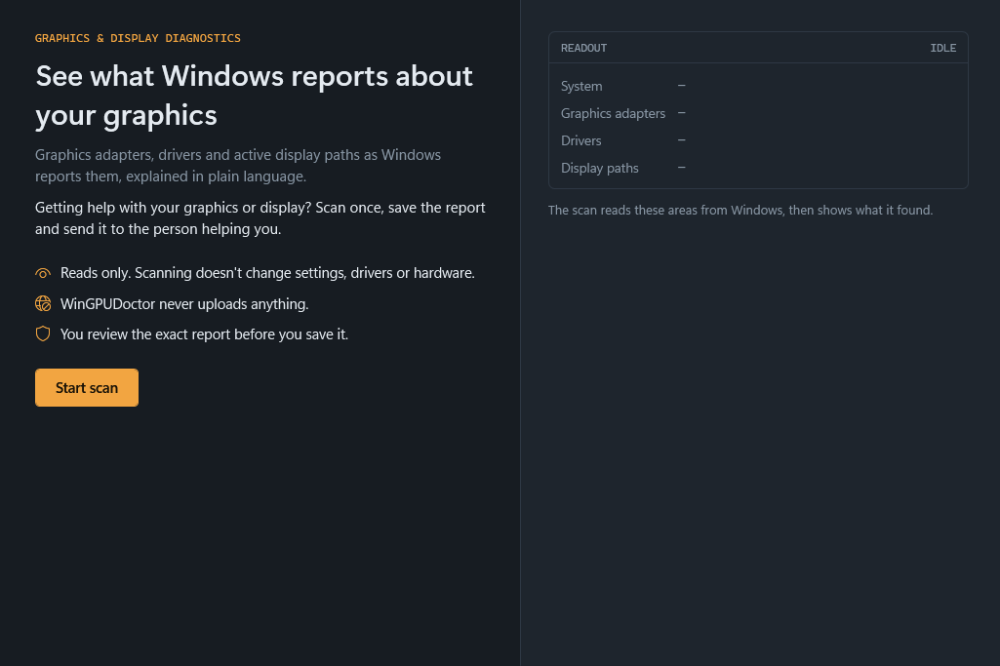
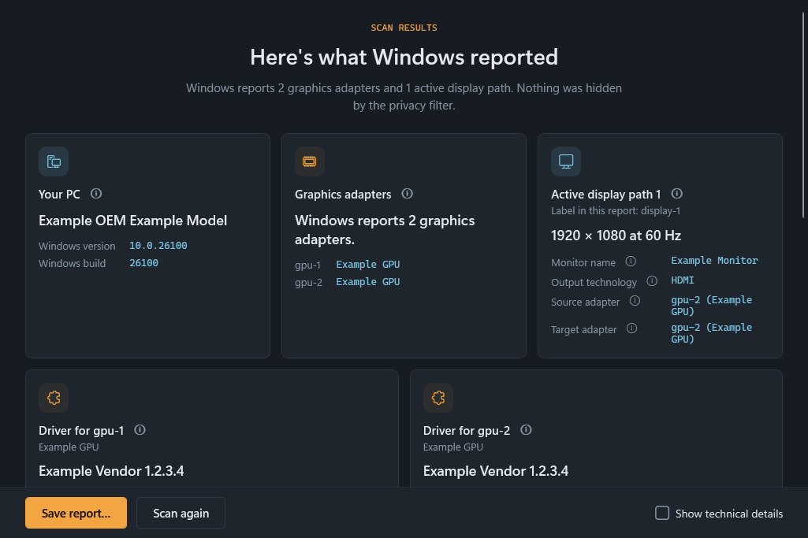
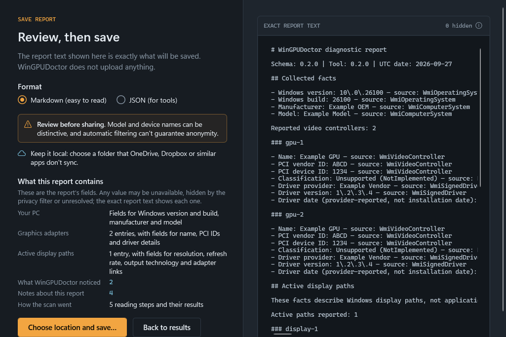

# WinGPUDoctor

**Read → Explain → Report.** A read-only Windows GPU/display diagnostics project.

Milestones 1–3 provide a small CLI for inventory and **active display paths**. M4 routes five fixed read-only operations through short-lived workers, with controlled cancellation. M5 — Explainable Active-Display Associations — adds informational findings for exact endpoint associations, unresolved correlation, unavailable targets and available empty topology; it was checkpointed at `43d3bc39a6310a48ca7f819bf307650f3afaa6a1`. v0.1.0 was published on 2026-09-25 as a command-line tool; version 0.2.0 adds the desktop app `wingpudoctor-gui` (M7) in the same package. Packaged validation has covered one laptop; evidence is specific to each candidate ZIP, so a refreshed ZIP requires its own checks. See `STATUS.md` and `docs/VALIDATION.md` in the source repository for current milestone and candidate evidence. The tool does not certify GPU health.

## Quick start: the WinGPUDoctor app

The desktop app, `wingpudoctor-gui.exe`, is for people who don't use a console. It reads what Windows reports about your graphics adapters, drivers and active displays, explains it in plain language, and saves a report you can send to someone who is helping you. Scanning doesn't change settings, drivers or hardware; the app writes a file only when you choose to save a report, and it uploads nothing.



The screenshots in this guide show made-up example data, not a real PC. In the downloaded package they are in the `docs/images` folder.

### 1. Download

On the [Releases page](https://github.com/erictyj1155/WinGPUDoctor/releases), download both files for version 0.2.0:

- `WinGPUDoctor-0.2.0-win-x64.zip`: the app, the command-line tool and the files they need.
- `WinGPUDoctor-0.2.0-win-x64.zip.sha256`: the ZIP's SHA-256 checksum.

WinGPUDoctor runs on 64-bit (x64) Windows. So far it has been tested on one Windows 11 x64 laptop only.

### 2. Install the .NET 10 Desktop Runtime (x64)

WinGPUDoctor needs Microsoft's free .NET 10 Desktop Runtime, which is not in the ZIP.

1. Open Microsoft's [.NET 10.0 download page](https://dotnet.microsoft.com/download/dotnet/10.0).
2. Under **.NET Desktop Runtime 10.0**, choose the **Windows x64** installer, run it and follow its steps.

It includes the .NET Runtime that the command-line tool uses. To see whether it is already installed, open **Settings → Apps → Installed apps** and search for "Windows Desktop Runtime": you need a 10.0 version marked x64.

### 3. Check the download

WinGPUDoctor is not code-signed, so Windows can't show a verified publisher for it. Before opening it, check that the ZIP is exactly the published file:

1. In File Explorer, open the folder that holds both downloads, right-click an empty area and choose **Open in Terminal**.
2. Run these two commands:

   ```powershell
   (Get-FileHash .\WinGPUDoctor-0.2.0-win-x64.zip -Algorithm SHA256).Hash
   Get-Content .\WinGPUDoctor-0.2.0-win-x64.zip.sha256
   ```

3. Compare the value from the first command with the first 64 characters of the line that the second command shows (the rest of that line is the file name); capital and small letters don't matter. The same value is also in the release notes. If they differ, don't open anything: delete the ZIP and download it again.

A matching checksum shows that the file arrived complete and unchanged; it can't prove who built it.

### 4. Extract and open

1. Right-click the ZIP, choose **Extract All…** and extract it to a folder on this PC, for example in Documents.
2. Open the extracted `WinGPUDoctor-0.2.0-win-x64` folder and double-click `wingpudoctor-gui.exe`.

Keep the folder together: the app needs the files and the `worker` folder beside it, so don't open it from inside the ZIP. The app itself has no installer (only the .NET Desktop Runtime from step 2 is installed), and it needs no administrator rights.

### 5. If Windows SmartScreen appears

Because the app isn't signed, Windows may show **Windows protected your PC** with "Unknown publisher". If the checksum matched in step 3, select **More info**, then **Run anyway**. If you are not sure, select **Don't run**.

If the app doesn't open at all, check that the .NET 10 Desktop Runtime (x64) from step 2 is installed.

**The first run.** Because the app isn't signed, the first time you open it or scan, Windows may show the SmartScreen warning above or a Windows Security notification that it is scanning the app. If a reading step doesn't finish during the first scan, the app shows "Didn't finish in time" for the values it could not read; scanning again may help.

### 6. Scan

Select **Start scan**. A scan can take up to about a minute, and you can select **Cancel** while it runs. The app only reads information from Windows; it doesn't change settings, drivers or hardware.

### 7. Read the results



The results start with one summary sentence, followed by cards:

- **Your PC**: Windows version and build, manufacturer and model.
- **Graphics adapters**: each adapter Windows reports, with a label such as `gpu-1`.
- **Active display path**: one card per active display path, with resolution, refresh rate, output technology and the adapters Windows associates with it.
- **Driver for gpu-1** (and so on): driver provider, version and the date the provider reports.
- **More about this scan**: what WinGPUDoctor noticed, notes about the report, how each reading step went, and what this scan can't tell you.

Select an ⓘ button, or move to it with Tab, for a plain-language explanation. **Show technical details** adds where each value came from and whether it could be read. Labels such as `gpu-1` and `display-1` exist only within this report.

### 8. Save the report and send it



1. Select **Save report…**.
2. Choose **Markdown (easy to read)** or **JSON (for tools)**. If you are not sure, ask the person helping you; Markdown is easier for people to read.
3. Read the report text on the right: it is exactly what will be saved. Model and device names can be distinctive, and the automatic privacy filter can't guarantee anonymity. Values it hides are marked as redacted.
4. Select **Choose location and save…** and pick a folder on this PC, preferably one that OneDrive, Dropbox or a similar app doesn't sync. WinGPUDoctor never replaces an existing file.
5. Send the saved file yourself, for example as an email or chat attachment. WinGPUDoctor never uploads anything.

### What WinGPUDoctor can and can't tell you

It can tell you what Windows reports:

- Windows version and build, and the manufacturer and model that the PC's firmware reports.
- The graphics adapters Windows lists, with PCI vendor and device IDs when recognizable, and each adapter's driver provider, version and provider-reported date.
- Each active display path: resolution, refresh rate, output technology, and which adapter its source and target are associated with when Windows provides an exact match.
- What could not be read, and which values the privacy filter hid.

It can't tell you:

- Which graphics adapter a game or app uses.
- How busy a graphics adapter is, or its power state.
- Whether hybrid graphics or a display mode switch (MUX) is active.
- Whether a driver is up to date; the driver date comes from the provider.
- Whether the PC, a graphics adapter or a display is healthy or working correctly, or what causes a problem.
- Which physical port a display is plugged into, or anything about displays that aren't active.

It doesn't fix, change or install anything. The only file it writes is a report you choose to save.

## Implemented

- Windows numeric version/build and firmware-reported computer manufacturer/model.
- WMI-reported video controllers, PCI vendor/device type IDs when recognizable, and matched driver provider/version/date.
- Active DisplayConfig paths with separate source/target adapters, source resolution, rational path/signal refresh, connector type, rotation, and availability.
- Exact DisplayConfig → SetupAPI device-instance → WMI inventory correlation; unmatched/ambiguous cases remain explicit. Clone/extended relationships use per-report source/target labels.
- Informational findings for exact endpoint associations, unresolved correlation, unavailable active-path targets, and an available result with no active paths. Each refers to evidence in the same sanitized report; repeated finding IDs distinguish paths by report-local evidence positions. No finding identifies an application's rendering GPU or explains a hardware cause.
- Explicit available, unknown, unsupported, failed, and redacted field states with provenance.
- Sanitized JSON and Markdown, console preview, and opt-in local file export without overwriting existing files.
- Deterministic tests using synthetic data; separate manual hardware checks.

Topology does not establish application GPU use, GPU utilization/power, MUX state, or Optimus/Advanced Optimus. iGPU/dGPU classification, inactive-display enumeration and vendor APIs remain unimplemented. No automatic fixes, telemetry, network client, background service, configuration writes, or elevation requests are implemented.

The Release CLI output contains a `worker/` directory with the framework-dependent `wingpudoctor-worker` deployment and its reviewed runtime inputs. The supervisor validates the recursive runtime closure, hashes and loaded/deployed assembly identities before launch, checks Ready identity before Start, and runs one worker per fixed operation. Provider/timeout failures remain incomplete reports; fatal host admission/deployment/cleanup failures stop preview/export. Schema 0.2.0, exit meanings, and report privacy are unchanged.

The first Ctrl+C while collection remains active cancels it in a controlled way: the in-flight worker uses bounded cleanup, no later operation starts, nothing is previewed or exported, and the process returns `3` with a plain cancellation notice. An atomic handoff decides cancellation versus normal output; after output is committed, a late interrupt follows ordinary/default behavior. A second Ctrl+C also permits default forced termination, with no cleanup, exit-code or report promise. Internal timing remains 60 s overall, 10 s per operation, 2 s cleanup and 8 s frame, supported by one-laptop measurements and engineering reserves; no timeout is user-configurable. Live evidence covers this laptop only. The final checkpoint-readiness review passed, and M4 was checkpointed locally at `57abbec81ac8db83e04a2a588d39fe18c1650070` before any push, tag, or release.

The local M2 check found one active internal path whose source and target both matched the same inventory adapter. Windows returned no monitor friendly name; that historical run remained unknown with partial-collection exit `3`. M3 keeps the name explicitly unknown but treats absence of that optional metadata as non-blocking, so six repeat collections completed with exit `0` while all path and correlation evidence stayed consistent. This describes this laptop only, not a persistent mode or broad compatibility claim.

## Command-line quick start

The portable `WinGPUDoctor-0.2.0-win-x64.zip` also contains the command-line tool, `wingpudoctor.exe`, beside the app. It is a framework-dependent application for Windows 11 x64, the only platform/configuration physically tested so far. Install a compatible **.NET 10 x64 runtime** (`Microsoft.NETCore.App`) first; the .NET 10 Desktop Runtime above includes it. The SDK and PowerShell are needed to build/package from source, not to run the extracted application. Run from an ordinary non-administrator console. No installer, administrator privilege, service, telemetry or automatic upload is involved.

Extract the ZIP to a local folder, open a console in its `WinGPUDoctor-0.2.0-win-x64` directory, and run:

```powershell
.\wingpudoctor.exe --help
.\wingpudoctor.exe
.\wingpudoctor.exe --format json
.\wingpudoctor.exe --format json --output .\report.json
```

With no arguments, the tool previews a privacy-projected Markdown report without creating a file. JSON preview goes to stdout. `--output` previews the same collected snapshot on stderr and saves it only after you type `EXPORT`; `--yes` with `--output` is deliberate non-interactive acceptance. The parent directory must exist; the destination must be on a local fixed drive. Existing files are never overwritten. Exit `0` means collection completed, `2` argument/platform/destination error, `3` either an incomplete collection whose report is still previewed or saved, **or collection stopped with no report** (a controlled first Ctrl+C or a fatal collection failure), `4` export declined, and `5` export failed. When collection stops with no report, nothing is written to stdout or the output file and stderr says `No report was exported.` A second interrupt permits ordinary forced termination without an exit-code or cleanup promise.

Review every report before sharing. Neutral labels and text filtering reduce exposure but cannot guarantee anonymity of customized device descriptions. The package includes `PRIVACY.md`; the source repository also has a report schema guide. Active display associations do not establish application rendering, electrical routing, MUX/graphics mode, GPU health or a hardware cause. Only one laptop with one internal active path has been physically validated; external displays, other GPU configurations, ARM64, remote/virtual sessions and other machines are unvalidated.

## Build and run from source

Initial validation target: Windows 11 x64. Other Windows versions, Windows on ARM, virtual machines, and remote sessions have not been validated. Use the .NET SDK selected by `global.json` (10.0.401 with later patches allowed). Dependency lock files are included. SDK/package restore needs internet; the built diagnostic program does not.

```powershell
# Process-local SDK settings: avoid SDK telemetry and first-run certificate creation.
$env:DOTNET_CLI_TELEMETRY_OPTOUT = '1'
$env:DOTNET_GENERATE_ASPNET_CERTIFICATE = 'false'
dotnet restore --locked-mode
dotnet build --no-restore -c Release -m:1 -p:UseSharedCompilation=false
dotnet test --no-build --no-restore -c Release
dotnet run --project src/WinGPUDoctor.Cli -c Release --no-build -- --help
dotnet run --project src/WinGPUDoctor.Cli -c Release --no-build
dotnet run --project src/WinGPUDoctor.Cli -c Release --no-build -- --format json
```

No arguments prints a sanitized Markdown preview; it does not create a file. JSON on stdout is also sanitized. Redirecting stdout saves it at your discretion. The SDK may print its own build/runtime messages; run the built app directly when a clean JSON stream is required:

```powershell
dotnet src/WinGPUDoctor.Cli/bin/Release/net10.0-windows/wingpudoctor.dll --format json
dotnet src/WinGPUDoctor.Cli/bin/Release/net10.0-windows/wingpudoctor.dll --format json --output report.json
```

`--output` shows a Markdown preview on stderr and asks you to type `EXPORT`. It saves that same snapshot without recollecting. In deliberate automation, `--yes` with `--output` accepts export without the prompt; preview still goes to stderr. Existing files are never overwritten. The parent directory must exist. Direct UNC/device paths, alternate data streams, and non-fixed drives are rejected. See [privacy](PRIVACY.md) for indirect/cloud folder limitations.

Exit codes: `0` collection completed; `2` invalid arguments/platform/destination; `3` incomplete collection, or collection stopped with no report (controlled first-interrupt cancellation, or a fatal worker admission/deployment/cleanup or other collection failure); `4` export declined; `5` export failed. A partial report can still be previewed or saved with exit code `3`; when collection stops with no report, stdout and the output file receive nothing and stderr says `No report was exported.` Export decline (`4`) or failure (`5`) takes precedence over an incomplete-collection `3`. An empty optional monitor friendly name remains explicit `unknown/missingValue` without independently making collection partial; target-name API failures, missing required identity, invalid modes, unavailable targets, correlation failures, provider failures, and retry exhaustion remain incomplete. Attempted but unsupported topology is also incomplete; intentionally deferred features do not cause failure by themselves.

For this initial workspace, a SHA512-verified portable SDK is in ignored `.tools/dotnet`. The supplied scripts require PowerShell 7. `scripts/dev.ps1` uses the portable SDK when present, otherwise the installed SDK; it keeps SDK state/package cache under `.tools` and disables telemetry and certificate generation. This folder is a local development convenience, not part of the distributed app.

The default local development/build workflow enforces locked restore but skips vulnerability auditing. This does not enforce offline operation: uncached packages may still be downloaded. Vulnerability auditing is a separate check, `./scripts/dev.ps1 -Action audit`, which uses locked restore with auditing enabled and may need network access to advisory sources. CI retains audited restore; check the [GitHub Actions history](https://github.com/erictyj1155/WinGPUDoctor/actions) for hosted CI results. A deterministic test pass is not a dependency-security audit.

```powershell
./scripts/dev.ps1 -Action test
./scripts/package-v0.1.ps1  # release ZIP (CLI, GUI and worker/) and SHA-256 file under ignored artifacts/
./scripts/package-v0.1.ps1 -Dev  # the same contents named -dev: a local test package, not a release asset
# ./scripts/dev.ps1 -Action preview invokes live collection; run only with live-check scope.
# Opt-in repeatability check for the current laptop build:
./scripts/validate-m3.ps1
# Opt-in live checks (require an existing Release build and real hardware):
./scripts/validate-m4-final.ps1
./scripts/test-m4-cancel.ps1 -Mode Cancel -Runs 1
```

## Project map

For any new contributor or coding agent, start with [AGENTS.md](AGENTS.md) → [STATUS.md](STATUS.md) → actual Git status/diff/history → relevant code/tests. These repository records support handoff across models and providers without conversation memory. After authorized work and verification, update the current status if it changed; keep dated evidence in the existing validation record.

```text
src/
  WinGPUDoctor.Core/       Facts, states, rules, privacy boundary, JSON/Markdown
  WinGPUDoctor.Protocol/   Strict internal worker protocol v1 frames and payloads
  WinGPUDoctor.Windows/    Local WMI, isolated DisplayConfig/SetupAPI, matching
  WinGPUDoctor.Supervisor/ Parent budget, worker deployment, Job/process/pipe transport
  WinGPUDoctor.Worker/     Framework-dependent internal operation dispatcher
  WinGPUDoctor.Host/       UI-free scan session and local export rules shared by hosts
  WinGPUDoctor.Cli/        Arguments, preview, explicit local export
  WinGPUDoctor.Desktop/    WPF desktop app, wingpudoctor-gui (M7)
tests/WinGPUDoctor.Tests/  Synthetic unit and collector-contract tests
docs/                     Feasibility, schema guide, decisions, validation
schemas/                  Versioned JSON Schema
examples/                 Synthetic reports only
scripts/                  Development and opt-in hardware checks
.github/workflows/        Deterministic Windows CI; no uploaded system reports
```

Start with [API feasibility](docs/API-FEASIBILITY.md), [architecture](ARCHITECTURE.md), [report schema](docs/REPORT-SCHEMA.md), and [validation evidence](docs/VALIDATION.md). Decisions are recorded in [ADRs](docs/decisions/README.md). See [roadmap](ROADMAP.md), [contributing](CONTRIBUTING.md), and [security](SECURITY.md).

MIT licensed. See [STATUS.md](STATUS.md) for the current Git/commit state and handoff, and [validation evidence](docs/VALIDATION.md) for dated checks. Repository workflow and contribution guidance are in [AGENTS.md](AGENTS.md) and [CONTRIBUTING.md](CONTRIBUTING.md).
